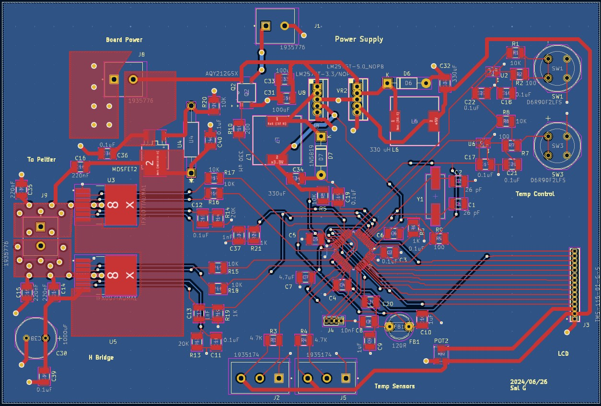
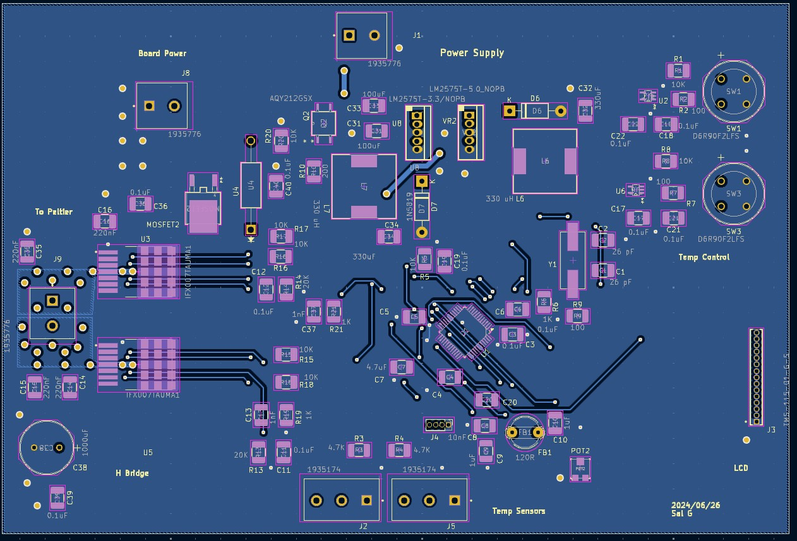

# mini-hvac-v1
A project aimed at creating a mini HVAC system for controlling the temperature of a model room.

Under the "PCB" file, there are KiCAD files showing all components and the PCB design.

Under the "symbols_footprints" folder, there are all the symbols and footprints used in the PCB design. These must be downloaded in order for the PCB file to work correctly in KiCAD.

Under the "Mechanical_CAD" file, there are FreeCAD files showing the mechanical assembly of the design.

Under the "C_program" file, there is the C code for the control loop, created using STM32 Cube IDE.

